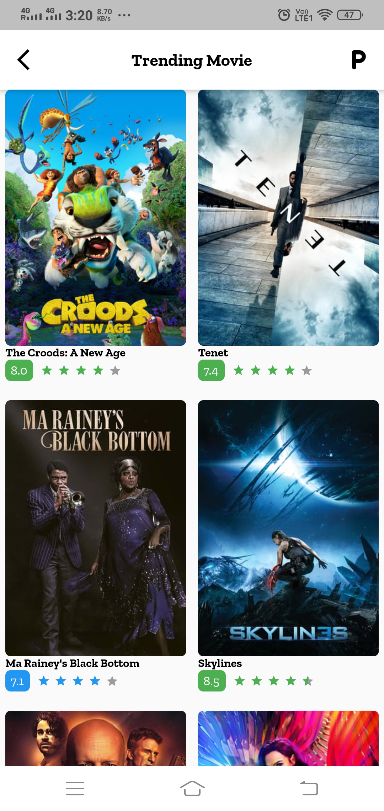
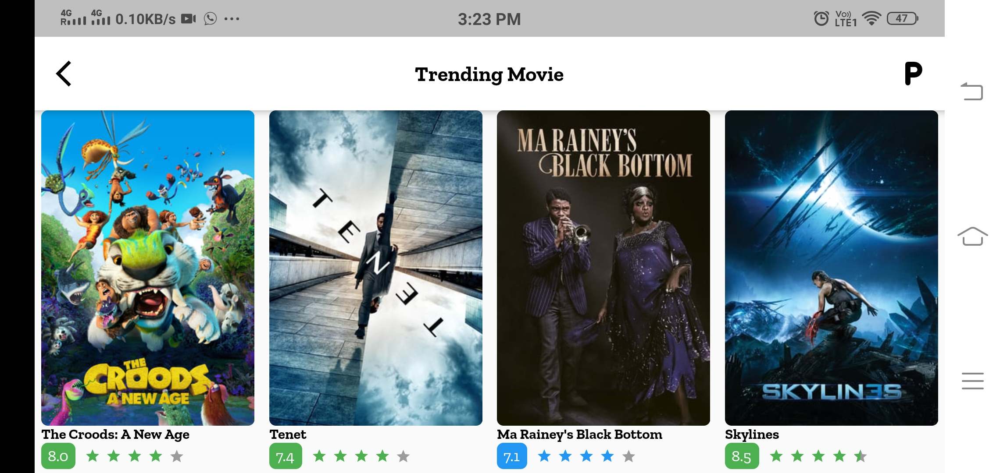

# Flutter Architecture

Flutter architecture is architecture for flutter with help of Scope model.

[](LICENSE)


## Component Used

  * Scope Model
  * Dio
  * Cache Image
  * Shimmer
  * Custom Fonts
  
## Apk

***You can Install and test latest Kotlin Demo app from below 👇***

[](https://github.com/webaddicted/Flutter-architecture/tree/master/apk/flutterarch.apk)


## ScreenShot

    

 

### Repository File

     fetchNowPlaying({String endPoint, int page}) async {
       try {
         var commonReq = CommonMovieReq.page(page.toString()).toJson();
         final response = await apiHelper.getWithParam("${endPoint}", commonReq);
         return ApiResponse.returnResponse(
             response, NowPlayingRespo.fromJson(jsonDecode(response.toString())));
        } catch (error, stacktrace) {
         return ApiResponse.error(
             errCode: ApiRespoCode.known,
             errMsg: error.toString(),
             errBdy: stacktrace.toString(),
             data: null);
        }
     }
    
### Model File

       trandingMovie(int pageSize) async {
          _trandingMovieRespo = ApiResponse.loading();
          notifyListeners();
          _trandingMovieRespo = await _movieRepo.fetchNowPlaying(
              endPoint: ApiConstant.TRENDING_MOVIE_LIST, page: pageSize);
          notifyListeners();
       }
 ## Flow Diagram
 
 


   
   
   
### View(UI)
            @override
        Widget build(BuildContext context) {
          var homeIcon = IconButton(
              icon: Icon(
                Icons.arrow_back_ios,
                color: ColorConst.BLACK_COLOR,
              ),
              onPressed: () => SystemNavigator.pop());
          return WillPopScope(
              onWillPop: () {
                return onWillPop(context);
              },
              child: Scaffold(
                  appBar: getAppBarWithBackBtn(
                      ctx: context,
                      title: 'Trending Movie',
                      bgColor: Colors.white,
                      icon: homeIcon,
                    ),
                  body: OrientationBuilder(
                      builder: (context, orientation) => ScopedModel(
                          model: model, child: apiresponse(orientation)))));
        }

        Widget apiresponse(Orientation orientation) {
          return ScopedModelDescendant<MovieScopeModel>(
            builder: (context, _, model) {
              var jsonResult = model.getTrandingMovie;
              if (jsonResult.status == ApiStatus.COMPLETED) {
                return _createUi(jsonResult.data, orientation);
              } else
                return apiHandler(
                    loading: RowMoviesScreen(
                      isShowShimmer: true,
                    ),
                    response: jsonResult);
            },
          );
        }


        
## LICENSE
```


                                 Apache License
                           Version 2.0, January 2004
                        http://www.apache.org/licenses/

             TERMS AND CONDITIONS FOR USE, REPRODUCTION, AND DISTRIBUTION

```


